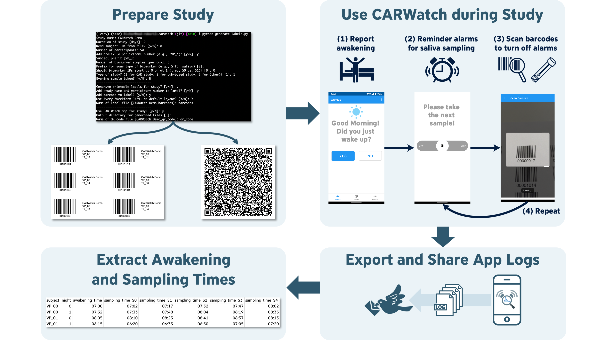

# CARWatch

[](https://pypi.org/project/carwatch/)

[](https://codecov.io/github/mad-lab-fau/carwatch)
[](https://github.com/mad-lab-fau/carwatch/actions/workflows/test-and-lint.yml)
[](https://github.com/psf/black)


**Get the Android app on the Play Store:**  
[](https://play.google.com/store/apps/details?id=de.fau.cs.mad.carwatch)

CARWatch is an open-source framework to support **objective** and **low-cost** assessment of cortisol samples. 
Its primary focus especially, but not limited to, during the **cortisol awakening response (CAR)** in real-world, unsupervised environments.
It consists of an [Android application](https://github.com/mad-lab-fau/carwatch-app) that schedules sampling times and tracks
them by scanning a barcode on the respective sampling tube as well as a Python package that provides tools to 
**configure studies** and **prepare the study materials** and to **process the log data** recorded by the app.


## Features

In order to use CARWatch, you need to prepare the study materials and configure the app. The whole workflow is
illustrated in the following figure:



All these features are provided by `carwatch` which offers a user-friendly command-line interface (CLI)
for the following tasks: 
1. **Setting up a CAR study.**   
This includes: 
   * Customizing study properties to your needs
   * Setting up your desired sampling schedule
   * Generating a QR-Code for the [CARWatch app](https://github.com/mad-lab-fau/carwatch-app) to automatically set up 
   the study in the app

2. **Creating printable labels with barcodes for objective sampling time assessment.**  
This includes:
   * Customizing the numer of saliva samples per day, the number of days, and the number of study participants
   * Adding an optional evening saliva sample
   * Customize barcodes to fit your printable label templates

3. **Analyzing the CARWatch log data.**  
This includes:
   * Extracting the sampling timestamps from the log data
   * Extracting the self-reported awakening times (if available)
   * Merging the time information with the cortisol measures


## Installation

`carwatch` requires Python >=3.8. First, install a compatible version of Python 
(e.g. using [miniconda](https://docs.conda.io/en/latest/miniconda.html)). Then, open a terminal (or Anaconda prompt)
and install the `carwatch` package via pip:

```bash
pip install carwatch
```

Alternatively, you can download the package directly from the source repository on GitHub:
```bash
git clone https://github.com/mad-lab-fau/carwatch.git
cd carwatch
pip install .
```


### For Developer

If you are a developer and want to contribute to `carwatch` you can install an editable version of the package from 
a local copy of the repository.

`carwatch` uses [poetry](https://python-poetry.org) to manage dependencies and packaging. Once you installed poetry, 
run the following commands to clone the repository, initialize a virtual environment and install all development 
dependencies:

```bash
git clone https://github.com/mad-lab-fau/carwatch.git
cd carwatch
poetry install
```

## Usage

`carwatch` can be used both **programmatically** and with the provided **command line interface (CLI)**.

The core functionalities of the `carwatch` package are

* creating a QR-Code for configuring the [CARWatch App](https://github.com/mad-lab-fau/carwatch-app) (Preparation),
* creating a PDF with printable barcode labels for the saliva sampling tubes (Preparation),
* and extracting the sampling times for the CARWatch app log recordings (Postprocessing).

### Programmatic Usage

For the preparation steps, the study details can be specified using the `Study` class. Participant IDs can also be 
parsed from a *.csv file, when the path to it is specified as `subject_path`, and the corresponding column as 
`subject_column`. 

Some basic examples are given below. For more information about the available parameters, please refer to the
documentation of the mentioned classes.

#### Study Setup Example

```python
from carwatch.utils import Study

study = Study(
    study_name="ExampleStudy",
    num_days=3,
    num_subjects=15,
    num_samples=5,
    subject_prefix="VP_",
    has_evening_sample=True,
    start_sample_from_zero=True,
)
```

#### Barcode Generation Example

For generating barcodes, the `LabelGenerator` class can be used, receiving a `Study` instance as a parameter. Your
custom printing label layout can be specified using the `CustomLayout` class. By default, the 
[_AveryZweckform J4791_](https://www.avery-zweckform.com/vorlage-j4791) layout is used.   
To start the PDF generation, call the `generate` method of the `LabelGenerator` class. The output PDF will be exported 
to the directory specified by `output_dir` (per default: the current working directory).

```python
from carwatch.utils import Study
from carwatch.labels.print_layout import CustomLayout
from carwatch.labels.label_generator import LabelGenerator

study = Study(
    study_name="ExampleStudy",
    num_days=3,
    num_subjects=15,
    num_samples=5,
    subject_prefix="VP_",
    has_evening_sample=True,
    start_sample_from_zero=True,
)
generator = LabelGenerator(study=study, add_name=True, has_barcode=True)
layout = CustomLayout(
    num_cols=3,
    num_rows=4,
    left_margin=3,
    right_margin=3,
    top_margin=2,
    bottom_margin=2,
    inter_col=0.2,
    inter_row=0.5,
)
generator.generate(output_dir=".", debug=True, layout=layout)
```

#### QR-Code Generation Example

For generating the QR-Code, the `QrCodeGenerator` class can be used, again receiving a `Study` instance as a parameter.
The `saliva_distances` parameter specifies the desired distances between saliva samples in minutes. The resulting 
QR-Code for setting up the CARWatch App will be exported to the directory specified by `output_dir` directory 
(per default: the current working directory).

```python
from carwatch.qr_codes import QrCodeGenerator
from carwatch.utils import Study

if __name__ == "__main__":
    study = Study(
        study_name="ExampleStudy",
        num_days=3,
        num_subjects=15,
        num_samples=5,
        subject_prefix="VP_",
        has_evening_sample=True,
        start_sample_from_zero=True,
    )
    generator = QrCodeGenerator(study=study, saliva_distances=[10, 10, 10], contact_email="dum@my.com")
    generator.generate(output_dir=".")
```

#### Postprocessing Example

To be added

### Command Line Interface

For the preparation steps, `carwatch` also provides a CLI for more convenient usage.
Make sure you installed the `carwatch` package with `pip install carwatch`.

After that, you can simply run the TUI (terminal user interface) by running
```
prepare_study tui
```
in a terminal session.

This will implicitly run the `scripts/prepare_study.py` script, which will guide you through the preparation steps.
You will then be prompted to enter all the required information step-by-step. The desired output files will 
be automatically generated for you.

The regular command line interface (CLI) can be used by running
```
prepare_study run
```

For more information about the prompted commands please run:
```
prepare_study run --help
```

## License

This project is licensed under the MIT License. See the LICENSE file for details.

## Contributing

We welcome contributions to `carwatch`! For more information, have a look at the [Contributing Guidelines](CONTRIBUTING.md).

## Citing carwatch

If you use `carwatch` in your work, please report the version you used in the text. Additionally, please also cite 
[our paper](https://www.sciencedirect.com/science/article/abs/pii/S0306453023000513?via%3Dihub) published in 
Psychoneuroendocrinology:

```
Richer, R., Abel, L., Küderle, A., Eskofier, B. M., & Rohleder, N. (2023). CARWatch – A smartphone application for 
improving the accuracy of cortisol awakening response sampling. Psychoneuroendocrinology, 151, 106073. 
https://doi.org/10.1016/j.psyneuen.2023.106073
```

## Contact

If you have any questions or feedback about CARWatch, please contact
[Robert Richer](mailto:robert.richer@fau.de).

